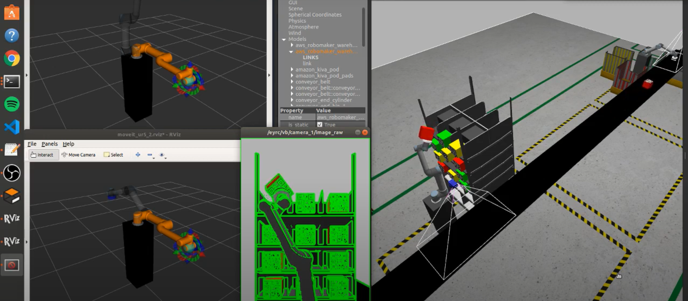
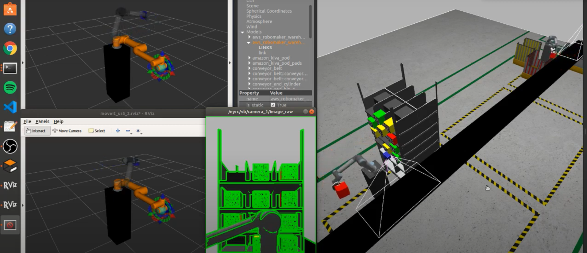
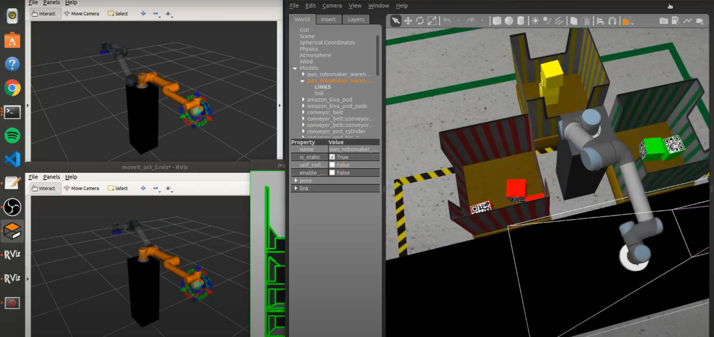
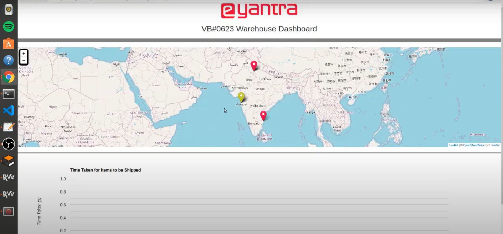
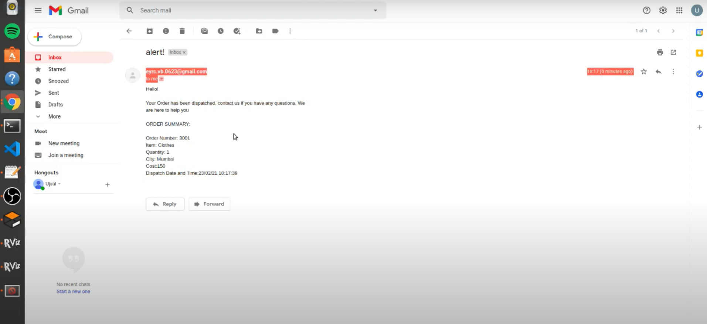
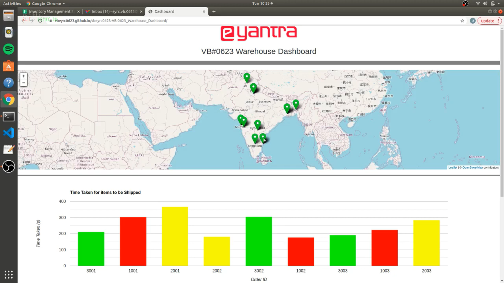

# Warehouse Automation
Automating a warehouse using Robotics Operating System. Created in EYRC competition of IIT Bombay.

- This project is on the theme of "Vargi Bots" of "e-Yantra Robotics Competition".
- There are 2 Robotic arms who are supposed to pick the packages according to the incoming orders and their priorities.
- User is informed when his order is been delivered & shipped via email.
- A Dashboard is been maintained which contains information about packages & their status.

## Youtube Video
https://www.youtube.com/watch?v=lTtzu_QFM3c

### Robotic arms picking up the packages

### Dashboard is been updated

### User getting udates of his order via email

### Dashboar after all the packages are been delivered & shipped

